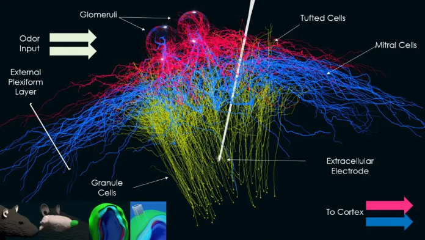

Olfactory Bulb Model Documentation
=========================================

This is the documentation site for the `olfactory bulb model <https://olfactorybulb.org/>`_ developed by `Justas Birgiolas Ph.D. <https://www.linkedin.com/in/justasbirgiolas>`_

 - Model Website: https://olfactorybulb.org/
 - Documentation (this site): https://docs.olfactorybulb.org/
 - Source Code Repository: https://github.com/justasb/olfactorybulb
 - Pre-built Docker Images: https://hub.docker.com/repository/docker/jbirgio/olfactory-bulb
 - Ph.D. Dissertation Describing the Model: `Towards Brains in the Cloud: A Biophysically Realistic Computational Model of Olfactory Bulb <https://repository.asu.edu/attachments/223567/content/Birgiolas_asu_0010E_19503.pdf>`_

The model and related `BlenderNEURON model editing tool <https://blenderneuron.org/>`_ were developed in collaboration with `researchers at the ICON Lab at Arizona State University <https://iconlab.asu.edu/>`_.

Citation
========

If you use this model in your project, please cite it as follows:

::

    @phdthesis{birgiolas2019towards,
      title={Towards Brains in the Cloud: A Biophysically Realistic Computational Model of Olfactory Bulb},
      author={Birgiolas, Justas},
      year={2019},
      school={Arizona State University}
    }

Table of Contents
=================

.. toctree::
   :maxdepth: 1

   gettingstarted
   visualizing
   recreating
   cloud
   olfactorybulb

Indices and tables
==================

* :ref:`genindex`
* :ref:`modindex`
* :ref:`search`
