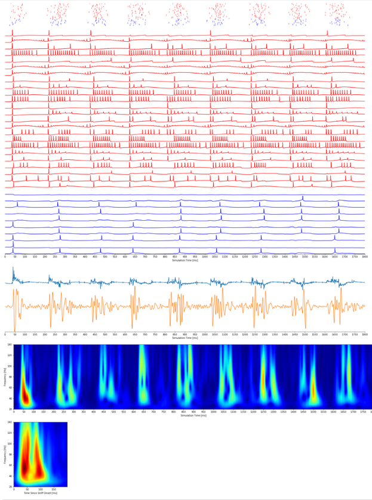

# Run Network Model & Reproduce Experiments

The easiest way to run the model is to use [Docker](https://www.docker.com) 
(a kind of virtualization software). After installing Docker, you will download the model's Docker image
hosted on DockerHub, and run the image. The image contains everything needed to run the model 
(NEURON, Python, MPI, all required OS and Python packages). The image will open a Jupyter Lab environment
which you can use to interact with the model.

## Install Docker

Follow the [steps for your OS to install Docker](https://www.docker.com/products/docker-desktop) 
on your machine.

## Download the Olfactory Bulb Model Image
In your OS terminal, run the following command to download the model image from DockerHub:
```
docker pull jbirgio/olfactory-bulb:latest
```

## Run the Image and Open Jupyter Lab
Once the image is downloaded, run the image with the following command:
```
docker run -p 8888:8888 jbirgio/olfactory-bulb:latest
```

The Docker container will start and load the image. The image is programmed to start
a Jupyter Lab environment. In the terminal output, you should see a URL that looks something like:


```
http://127.0.0.1:8888/?token=6e7edee...0e02142
```

Copy and paste the URL into your browser to open the Jupyter Lab environment that is running inside
the model's Docker container.

## Run the Notebook with Experiments
On the right panel of Jupyter Lab, find the `notebooks` folder and open the `LFP Wavelet Analysis` notebook.
Then run all the cells of the notebook.

Once the simulation starts, you should see something like this:

```
Starting paramset: GammaSignature (1/5)...
numprocs=16
Rank Complexity min: 551, mean: 662.625, max: 791
Starting simulation...
Time: 10.0 ms
```

After the simulations finish, running the next cell will plot the simulation output:



 - The first row contains the odor input spikes to the glomerular tufts of mitral (blue) and tufted (red) cells.
 - Next are the somatic voltage traces of tufted (red) and mitral (blue) cells
 - The next trace is the raw LFP signal
 - Then the LFP signal band-pass filtered to include frequencies between 30-120 Hz 
 - Then a wavelett spectrogram of the filtered LFP signal
 - Finally, the average LFP spectrogram across all the sniffs, containing the two-cluster gamma fingerprint 
 
The remaining cells demonstrate how the gamma fingerprint is disturbed when one of the key network mechanisms is disabled.

# Adjusting Parameters
The `show_plots` function takes the name of a parameter set Python class. 

To change the simulation parameters, 
use the right panel in Jupyter Lab to open the `[repo]/olfactorybulb/paramsets/case_studies.py` file. 

After modifying e.g. the `GammaFingerprint` class, rerun the simulation with the new parameter values 
with this notebook command:

```
!cd ..; mpiexec -np 16 python initslice.py -paramset GammaSignature -mpi
```
Replace `16` with the number of cores in your machine.

After simulation completes, re-run the `show_plots` function to see the updated results:

```
show_plots('GammaSignature', sniff_count=8)
```

# Model Documentation
 
 Take a look the [Model Documentation](https://docs.olfactorybulb.org) to learn more about how the model was built and to make further modifications.

# Citation

If you use this model or parts of it in your project, please cite the model as follows:

```
@phdthesis{birgiolas2019towards,
  title={Towards Brains in the Cloud: A Biophysically Realistic Computational Model of Olfactory Bulb},
  author={Birgiolas, Justas},
  year={2019},
  school={Arizona State University}
}
```

# Folders

**Folders needed to run the network model**

 - `olfactorybulb` Classes and database defining the network model
 - `prev_ob_models` Cell and network models developed by others, but cell models under `Birgiolas2020` are used in this network model. The models are compared against experimental data and to each other. 
 - `blender-files` Stores .blend used in network construction (e.g. layer coordinates)
 - `initslice.py` Runs the network model using a provided parameter set
 - `docker` Docker scripts to run the model using Docker 
   
   
**Folders used to construct the network model and cell models**

 - `digitized-figures` Extracted figures that contained experimental data used in the model
 - `morphology-data` Subfolders with .SWC morphology archives from [NeuroMorpho.org](http://neuromorpho.org/) of the three cell types
 - `neuronunit` [NeuronUnit](https://github.com/scidash/neuronunit/) classes that define tests used to validate cell models
 - `notebooks` Jupyter notebooks used to validate, fit, and simulate the cell and network models
 - `worksheets` Excel worksheets used to derive experimental data properties when they were not directlya vailable
  
**Other folders**
 - `notes` Mostly notes and temporary model validation files
 - `dissertation-figures-tables` Excel spreadsheets of some dissertation tables
 - `media` Images of dissertation figures and videos used in dissertation defense slides
  
# Other Files

 - `prev_ob_models/compile_mod.sh` Compiles all .mod files 
 - `runbatch.py` Allows specifying different parameter sets and runs the model with each set
 - `testmpi.py` A test of NEURONs MPI-based network
 
 
